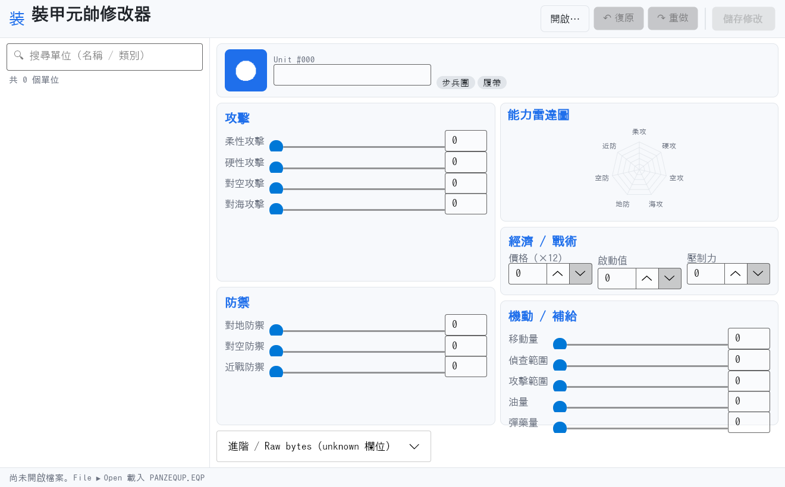

# 裝甲元帥編輯器 (Panzer General Editor)

針對 **Panzer General (DOS/WIN95)** 與 **Allied General** 的裝備檔
(`PANZEQUP.EQP`) 編輯器。可讀取與修改每個單位的數值:攻擊力、防禦力、
射程、偵查、移動量、油量、彈藥、價格等。

本 repo 包含兩個版本:

| 版本 | 技術 | 狀態 |
|---|---|---|
| **PGEdit.Avalonia** | .NET 8 + Avalonia 11,跨平台 (Win / Linux / macOS) | **主要開發版** |
| `PGEdit/` (舊版) | WinForms + .NET 4.5,Visual Studio 2012 | 保留不動 |

兩個版本共用底層解析器 `PGEQReader/`。

---

## PGEdit.Avalonia



### 功能

- **雙欄密集排版** — 攻擊/防禦在左,雷達圖、經濟、機動在右;單畫面看完不需捲動。
- **真實 PG hex 單位圖示** — 解析 `ART/TILEART.DAT` (SSI chunk-based 格式
  `Indx` / `Vers` / `CPal` / `RLEi`),抽出 256 個 `u###` hex sprite。EQP byte 42
  (`_little_icon`) 直接 index 進 `Assets/units/u<NN>.png`,跟遊戲中 hex 格子內
  顯示的 sprite 完全一致。
- **Dark / Light 主題** — 預設 Notion 風白底藍 accent,可由 `RequestedThemeVariant` 切換。
- **安全編輯** —
  - 首次儲存自動產生時間戳記 `.bak` 備份
  - 寫回前彈出 Diff 對話框列出每筆變更
  - Undo / Redo (Ctrl+Z / Ctrl+Y),深度 100
  - `NumericUpDown` 帶 range 驗證,避免亂打字破檔;價格自動修為 12 倍數
- **能力雷達圖** — 7 軸 (柔/硬/空/海 攻擊 + 地/空/近戰 防禦)。
- **搜尋與過濾** — 依名稱或類別即時過濾單位列表。
- **大字體** — 16 px 基準字級、64×64 單位圖示、寬鬆間距,長時間編輯不傷眼。
- **快捷鍵** — Ctrl+O 開啟 · Ctrl+S 儲存 · Ctrl+Z/Y 復原/重做 · ↑/↓ 上/下一個單位。

### 建置 (Docker,推薦)

不需要本機安裝 .NET SDK:

```bash
./PGEdit.Avalonia/docker-build.sh linux-x64
# →  PGEdit.Avalonia/out/linux-x64/PGEdit.Avalonia  (self-contained 單檔)
```

其他平台:

| 目標 | RID |
|---|---|
| Windows x64 | `win-x64` |
| macOS Apple Silicon | `osx-arm64` |
| macOS Intel | `osx-x64` |

### 建置 (本機 .NET 8 SDK)

```bash
cd PGEdit.Avalonia
dotnet publish -c Release -r <RID> --self-contained -p:PublishSingleFile=true -o ./out
```

### 目錄結構

```
PGEdit.Avalonia/
├── PGEdit.Avalonia.csproj      .NET 8 SDK-style;link 引用 PGEQReader source
├── Program.cs, App.axaml/.cs   進入點 + Fluent + dark/light palette
├── Models/                     UnitDto, UnitType, StatBounds, DiffRow
├── Services/                   EquipmentFileService, BackupService,
│                               UndoRedoService, UnitIconProvider
├── ViewModels/                 Main, UnitEditor, UnitListItem
├── Views/                      MainWindow.axaml, DiffDialog.axaml
├── Controls/                   StatRadarChart  (自製 Avalonia Control)
├── Themes/                     AppTheme.axaml  (.card / .h2 / .label utility class)
└── Assets/units/u000.png ~ u255.png
```

詳細說明見 [PGEdit.Avalonia/README.md](PGEdit.Avalonia/README.md)。

---

## 工具 (tools/)

`tools/` 目錄提供探勘 PG 資料檔 + 從不同 PG 安裝重抽 unit icon 的腳本:

- `pg-data-explorer.py` — 掃描 PG `DATA/` 或 `ART/` 目錄,輸出每個檔的 magic、
  entropy、ASCII 字串、hex header 摘要報告。
- `extract-art-dat.py` — 解析 SSI chunk-based `.DAT` 檔 (`Indx` TOC + `RLEi`
  RLE-encoded indexed bitmap + `CPal` palette),每個 sprite 輸出一張 PNG。
- `build-icon-picker.py` + `icon-picker.html` — 產出 self-contained 的 HTML
  sprite gallery (依尺寸分組,可搜尋、點選指派、匯出 shell 指令)。

詳細說明見 [tools/README.md](tools/README.md)。

---

## 舊版 `PGEdit/` (WinForms)

保留不動。需要 Visual Studio 2012 + .NET Framework 4.5 建置,或直接執行
`PGEdit/prebuilt/PGEdit.exe`。

---

## 作者

Chun-Yu Wang (wicanr2@gmail.com)
